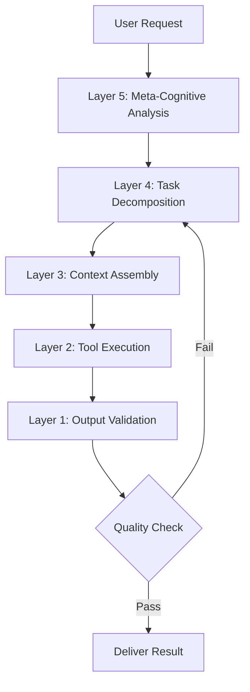
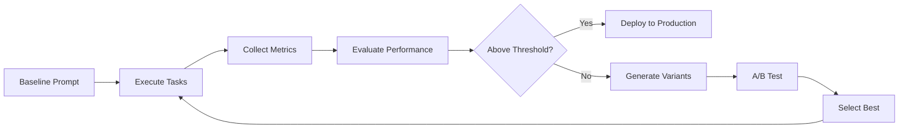

# ATLAS Architecture Documentation

## System Overview

ATLAS (Adaptive Thought-Layer Agentic System) implements a hierarchical cognitive architecture that mirrors human reasoning processes while leveraging AI’s computational advantages.

## Architectural Principles

### 1. Layered Abstraction

The five-layer cognitive stack provides clear separation of concerns:

```
┌─────────────────────────────────────────┐
│   Layer 5: Meta-Cognitive Director      │  ← Why are we doing this?
├─────────────────────────────────────────┤
│   Layer 4: Executive Planner            │  ← What steps are needed?
├─────────────────────────────────────────┤
│   Layer 3: Working Memory Manager       │  ← What context is relevant?
├─────────────────────────────────────────┤
│   Layer 2: Tool Orchestration Engine    │  ← How do we execute?
├─────────────────────────────────────────┤
│   Layer 1: Perception & Validation      │  ← Is input/output correct?
└─────────────────────────────────────────┘
```

### 2. Prompt Composition

Prompts are not static strings but dynamic, compositional structures:

#### Base Components

- **Meta-Context**: Task classification and requirements
- **Core Directive**: Primary instruction
- **Conditional Augmentation**: Context-sensitive enhancements
- **Constraint Boundaries**: Safety and quality guardrails
- **Output Specification**: Format and validation rules

#### Example Composition

```typescript
const prompt = composePrompt({
  metaContext: {
    taskType: "code_generation",
    complexity: 0.85,
    capabilities: { reasoning: 0.9, execution: 0.95 }
  },
  coreDirective: "Generate production-ready API wrapper",
  conditionalAugmentation: [
    IF(complexity > 0.7) => "Apply TDD methodology",
    IF(security_critical) => "Include vulnerability scanning"
  ],
  constraints: [
    "Minimum 80% test coverage",
    "Type-safe interfaces",
    "Comprehensive error handling"
  ]
});
```

### 3. Agent Specialization

Each agent type has optimized capabilities:

|Agent Type|Primary Strength|Use Cases                       |
|----------|----------------|--------------------------------|
|Research  |Analysis (98%)  |Literature review, fact-checking|
|Code Gen  |Execution (95%) |Software development, testing   |
|Creative  |Creativity (98%)|Content generation, design      |
|Analyst   |Analysis (98%)  |Data interpretation, patterns   |
|Strategist|Reasoning (95%) |Planning, decision-making       |
|Executor  |Execution (98%) |Task automation, workflows      |
|Critic    |Analysis (96%)  |Quality assurance, review       |

### 4. Memory Management

Four-tier memory system balances detail with efficiency:

#### Tier 1: Immediate (Full Detail)

- Last 3 interactions
- Complete context preservation
- Sub-second retrieval

#### Tier 2: Recent (Key Points)

- Last 20 interactions
- Extracted summaries
- Fast lookup

#### Tier 3: Historical (Semantic Search)

- All prior work
- Vector embeddings
- Similarity-based retrieval

#### Tier 4: Episodic (Critical Moments)

- Decision points
- High-impact events
- Permanent storage

## Data Flow

### Task Execution Pipeline



### Prompt Evolution Cycle



## Key Design Patterns

### 1. Recursive Refinement

Agents can improve their own prompts:

```python
def recursive_refinement(initial_prompt, max_iterations=3):
    current_prompt = initial_prompt
    
    for i in range(max_iterations):
        result = execute(current_prompt)
        quality = evaluate(result)
        
        if quality >= threshold:
            return current_prompt
            
        meta_prompt = f"""
        Analyze this prompt: {current_prompt}
        Execution result: {result}
        Quality score: {quality}
        
        Suggest improvements to increase quality.
        """
        
        improvements = meta_agent(meta_prompt)
        current_prompt = apply_improvements(current_prompt, improvements)
    
    return current_prompt
```

### 2. Collaborative Synthesis

Multiple agents contribute expertise:

```python
def collaborative_prompt_synthesis(task):
    # Each agent generates its specialized prompt component
    analyst_prompt = analyst_agent.generate_prompt(task)
    strategist_prompt = strategist_agent.generate_prompt(task)
    executor_prompt = executor_agent.generate_prompt(task)
    
    # Merge into composite prompt
    composite = merge_prompts([
        analyst_prompt,
        strategist_prompt,
        executor_prompt
    ])
    
    # Critic reviews and optimizes
    optimized = critic_agent.optimize(composite)
    
    return optimized
```

### 3. Uncertainty Quantification

Explicit confidence tracking:

```typescript
interface UncertaintyAwareOutput {
  highConfidence: Statement[];
  mediumConfidence: Statement[];
  lowConfidence: Statement[];
  assumptions: Assumption[];
  
  getOverallConfidence(): number;
  shouldEscalateToHuman(): boolean;
}
```

## Scalability Considerations

### Horizontal Scaling

- **Prompt Sharding**: Split complex prompts across multiple inference calls
- **Parallel Execution**: Run independent sub-tasks concurrently
- **Result Aggregation**: Intelligent merging of parallel outputs

### Vertical Optimization

- **Lazy Evaluation**: Execute prompt branches only when needed
- **Caching**: Store and reuse intermediate results
- **Adaptive Batching**: Group similar prompts for efficiency

### Resource Management

```yaml
resource_allocation:
  layer_5_meta_cognitive:
    cpu_priority: low
    memory_limit: 512MB
    timeout: 10s
  
  layer_2_tool_orchestration:
    cpu_priority: high
    memory_limit: 1GB
    timeout: 30s
```

## Safety Architecture

### Multi-Layer Defense

1. **Constitutional Layer**: Hard-coded ethical boundaries
1. **Dynamic Guardrails**: Context-sensitive safety checks
1. **Outcome Simulation**: Predict consequences before acting
1. **Human Oversight**: Automatic escalation for high-stakes decisions

### Adversarial Resistance

- Prompt injection detection
- Goal misalignment monitoring
- Jailbreak attempt identification
- Continuous red-team evaluation

## Performance Optimization

### Prompt Caching Strategy

```typescript
interface PromptCache {
  // Cache compiled prompts
  compiled: Map<string, CompiledPrompt>;
  
  // Cache execution results
  results: LRUCache<string, ExecutionResult>;
  
  // Cache embedding vectors
  embeddings: VectorStore;
}
```

### Metrics Collection

```typescript
interface PerformanceMetrics {
  promptGenerationTime: number;
  executionTime: number;
  tokenCount: number;
  cacheHitRate: number;
  successRate: number;
  userSatisfaction: number;
}
```

## Integration Points

### External Systems

- **Vector Databases**: For semantic search and embeddings
- **Time Series DBs**: For execution history and metrics
- **Message Queues**: For async task processing
- **API Gateways**: For tool orchestration

### Monitoring & Observability

- Real-time performance dashboards
- Distributed tracing for multi-agent tasks
- Anomaly detection in prompt behavior
- A/B testing infrastructure

## Future Extensions

### Phase 1: Enhanced Capabilities

- Cross-modal reasoning (text + image + code)
- Real-time learning from feedback
- Federated prompt optimization

### Phase 2: Advanced Features

- Multi-organization prompt sharing
- Automated prompt marketplace
- Domain-specific specialized layers

### Phase 3: Research Directions

- Neural prompt architecture search
- Self-modifying cognitive structures
- Emergent agent collaboration patterns

-----

This architecture enables ATLAS to tackle increasingly complex tasks while maintaining safety, transparency, and user control.
